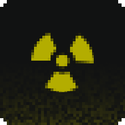

<h1 align="center">
  
  <p align="center">Atomic Framework</p>

  
  
  
  

  | [Download](/releases/latest/) | [Documentation](/wiki) |
</h1>

Atomic is a flexible, OOP-driven framework for building Garry’s Mod addons and gamemodes with a clean, modular architecture.
Each **package** is a self-contained unit - just like an addon - with built-in dependency management and powerful libraries for writing structured, maintainable Lua code.

```lua
local package = current()
local libui = package:getDependency("com.developername.libui")

package:listen(function(self)
  libui:drawText(self:getPhrase("en", "hello_world"), libui.textSize.small, ScrW() / 2, ScrH()/2, color_white, TEXT_ALIGN_CENTER)
end, "HUDPaint")

package:listen(function(self)
  self.logger:info("package successfully enabled")
end, "onEnable")
```
###### Real example of addon based on Atomic

---

## Installation
Simply place the framework in your `addons/` folder.
Atomic will automatically load available packages.

Optional dependencies:
- `MySQL` support / [MySQLOO](https://github.com/FredyH/MySQLOO)
- `git` support / [gm_git](https://github.com/TeamMeadows/gm_git)

---

## Contributing
We welcome all contributions — bug fixes, improvements, and new libraries are appreciated.
Please follow the [project’s coding style](./CODE_STYLE.md) and submit a pull request through GitHub.